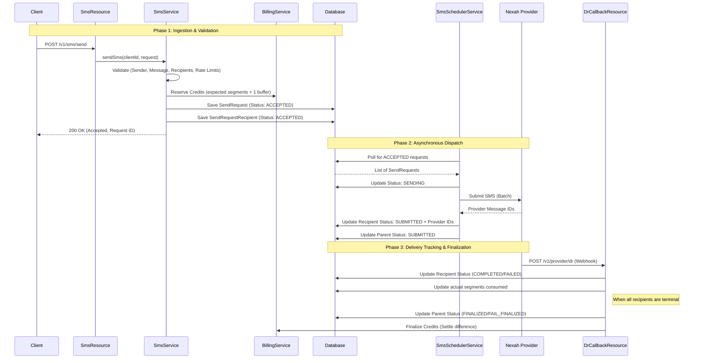
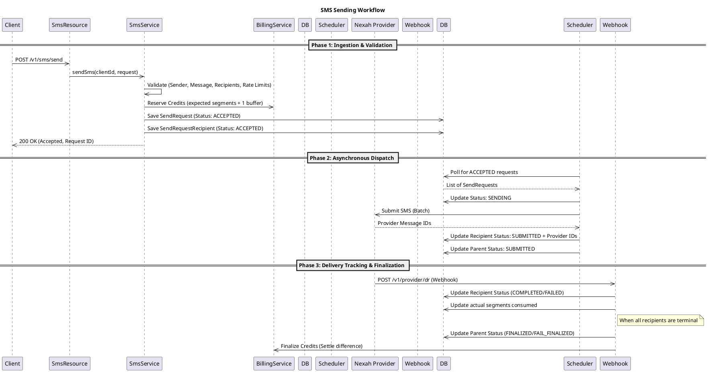

# SMS Sending Lifecycle

This document describes the end-to-end process of sending an SMS in the Sendam gateway, from the initial client request to the final delivery status update and credit reconciliation.

## 1. High-Level Overview

The SMS sending process is divided into three main phases:
1.  **Ingestion & Validation**: The API receives the request, validates it, and reserves credits.
2.  **Asynchronous Dispatch**: A background worker polls for accepted requests and submits them to the SMS provider.
3.  **Delivery Tracking & Finalization**: The provider sends delivery reports (DLR) via webhooks, which update the message status and finalize billing.

---

## 2. Detailed Sequence Diagram

The following diagram illustrates the interaction between components during the SMS lifecycle.

plantuml Diagram

---

## 3. Component Responsibilities

### Phase 1: Ingestion (`SmsResource` & `SmsService`)
-   **Authentication**: Handled by the API key security filter chain.
-   **Idempotency**: Checked via `sendRequestId` to prevent double-processing.
-   **Rate Limiting**: Enforced at both request level (10 req/s) and recipient level (1000/min).
-   **Validation**: 
    -   Sender ID format.
    -   Message content.
    -   Recipient phone number format (Cameroon mobile numbers).
    -   Future schedule time.
-   **Credit Reservation**: 
    -   Calculates segments using `SmsSegmentCalculator`.
    -   Reserves `(segments + 1) * recipients` to account for potential provider segment deviations.
-   **Persistence**: Saves the request as `ACCEPTED`.

### Phase 2: Dispatch (`SmsSchedulerService` & `SmsDispatchWorker`)
-   **Polling**: `SmsSchedulerService` runs every 30 seconds.
-   **Locking**: `SmsDispatchWorker` grabs batches of `ACCEPTED` requests and marks them `SENDING` to prevent duplicate dispatch in multi-node setups.
-   **Transmission**: Uses `NexahDispatchService` to send messages to the provider.
-   **Status Update**: Transitions recipients to `SUBMITTED` once the provider accepts the message and returns a `gatewayMessageId`.

### Phase 3: Delivery Reports (`DrCallbackResource` & `SmsProviderReportListener`)
-   **Webhook Reception**: `DrCallbackResource` receives DLRs from Nexah.
-   **Event-Driven Processing**: DLRs are converted into `ProviderDeliveryReportEvent`.
-   **Status Advancement**: `SmsProviderReportListener` updates individual recipients based on the DLR status (`DELIVRD` -> `COMPLETED`, otherwise `FAILED`).
-   **Finalization**: Once all recipients for a `SendRequest` reach a terminal state, the parent request is marked `FINALIZED` or `FAIL_FINALIZED`.
-   **Reconciliation**: Triggers an `SmsFinalisedEvent` which leads to credit settlement (releasing the buffer and charging the actual segments consumed).

---

## 4. Status Transition Map

### SendRequest (Parent) Statuses
-   **ACCEPTED**: Initial state after successful ingestion and credit reservation.
-   **SENDING**: Currently being processed by the dispatch worker.
-   **SUBMITTED**: Successfully handed over to the SMS provider.
-   **FINALIZED**: All recipients reached a terminal state (at least one success).
-   **FAIL_FINALIZED**: All recipients reached a terminal state, but all failed.
-   **CANCELLED**: Scheduled request was cancelled before dispatch.

### SendRequestRecipient Statuses
-   **ACCEPTED**: Initial state.
-   **SUBMITTED**: Provider has accepted the message and assigned an ID.
-   **COMPLETED**: Delivery confirmation received (DLR: `DELIVRD`).
-   **FAILED**: Permanent failure reported by provider or terminal retry state.

---

## 5. Recovery Mechanisms
-   **Stale Dispatch Recovery**: `SmsSchedulerService` recovers requests stuck in `SENDING` (e.g., node crash during dispatch) after 10 minutes by reverting them to `ACCEPTED`.
-   **Stale DLR Recovery**: Requests stuck in `SUBMITTED` for more than 24 hours are force-finalized to ensure credits are eventually settled.
